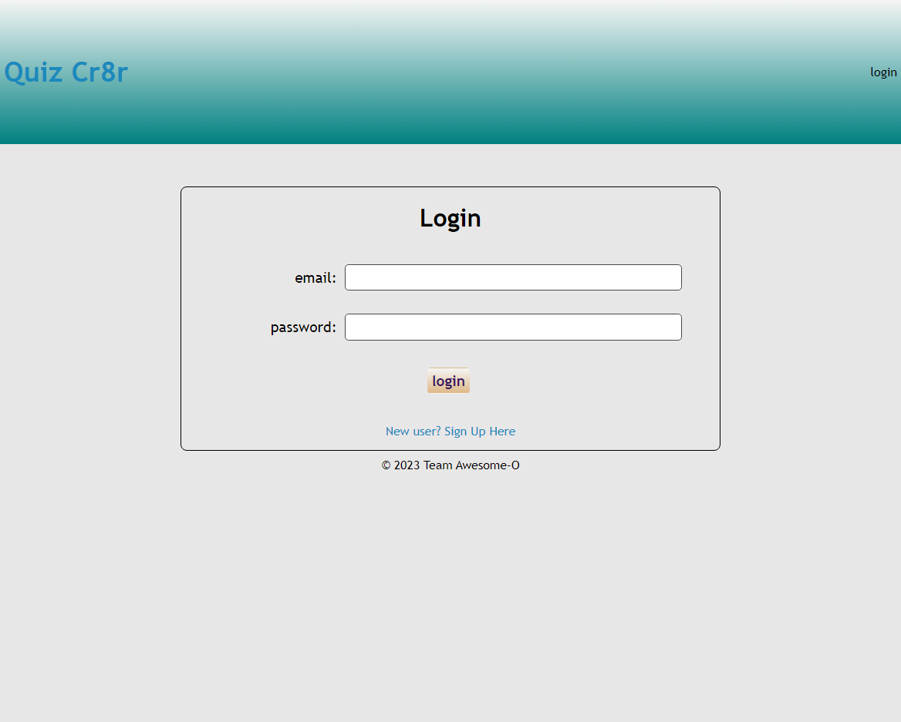

# QUIZ CR8TR

## Description
This project allows you to create your own quiz with its own time limit and set amount of questions. You are also able to update your quiz, whether it be the name of the quiz, questions, answer choices, and correct answer with the simple click of a button. This is a very useful tool that can be used as a study guide when creating your own quiz or even as a way to implenet graded quizzes to students in the near future.

## Table of Contents
* [Project Links](#project-links)
* [Usage](#usage)
* [Screenshots](#screenshots)
* [Credits](#credits)
* [License](#license)
* [Contributing](#contributing)
* [Tests](#tests)

## Links
* [Deployed Application](https://intense-forest-76320.herokuapp.com/login)
* [GitHub Repo](https://github.com/HumzaShaukat/QuizCR8R)

## Usage
To use this application you will need to have an account. On the home page there is a sign up link under the login button. Once your account is created you will be redirected to your home page that will display options such as quizzes you have created, scores on quizzes you have taken, the option to create a quiz, and the option to update your information. If you'd like to create your own quiz, click the "Create a Quiz" button and follow the instructions. Enter the quiz title, and proceed to enter the information for the question, the answers, and selecting the correct answer. Once you have added all your questions, select the "Finished adding questions" button. If you'd like to update anything on quizzes you have created simply click the quiz you want to edit and all available options will be displayed.

## Screenshots

## Credits
* [Howard Van Salisbury](https://github.com/hvansalisbury)
* [Humza Shaukat](https://github.com/HumzaShaukat)
* [Parker Faul](https://github.com/ParkerCF)
* [Jeaustin Sanabria](https://github.com/jeaustins27)
  
## License
  

This project is licensed under the [MIT](https://choosealicense.com/licenses/mit/) license.

## Contributing
You can help with contributing by reaching out on our GitHub Profiles listed under the [Credits](#credits)

